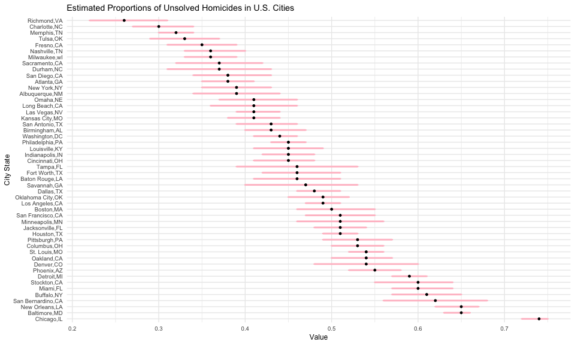
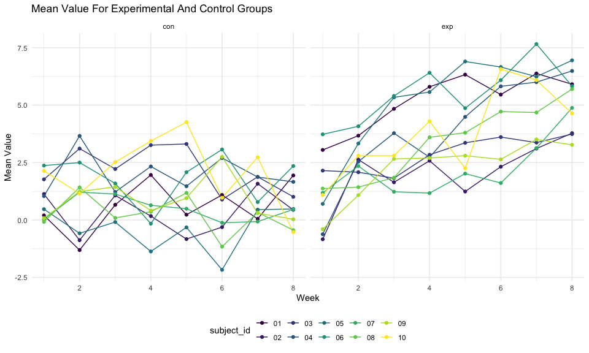

p8105 hw5 yz4185
================
Yitian Zhang

# Setup

``` r
library(tidyverse)
```

    ## ─ Attaching packages ──────────────────── tidyverse 1.3.1 ─

    ## ✓ ggplot2 3.3.5     ✓ purrr   0.3.4
    ## ✓ tibble  3.1.4     ✓ dplyr   1.0.7
    ## ✓ tidyr   1.1.3     ✓ stringr 1.4.0
    ## ✓ readr   2.0.1     ✓ forcats 0.5.1

    ## ─ Conflicts ───────────────────── tidyverse_conflicts() ─
    ## x dplyr::filter() masks stats::filter()
    ## x dplyr::lag()    masks stats::lag()

``` r
library(readr)
getwd()
```

    ## [1] "/Users/yitian/Desktop/P8105-HW5-yz4185"

``` r
set.seed(1)

knitr::opts_chunk$set(
  fig.width = 10,
  fig.asp = .6,
  out.width = "90%"
)

theme_set(theme_minimal() + theme(legend.position = "bottom"))

options(
  ggplot2.continuous.colour = "viridis",
  ggplot2.continuous.fill = "viridis"
)

scale_colour_discrete = scale_colour_viridis_d
scale_fill_discrete = scale_fill_viridis_d
```

# Problem 1

#### Import data and describe the raw data

``` r
urlfile = "https://raw.githubusercontent.com/washingtonpost/data-homicides/master/homicide-data.csv"

homicide_df = 
  read_csv(url(urlfile)) %>% 
   mutate(city_state = str_c(city, ", ", state))
```

    ## Rows: 52179 Columns: 12

    ## ─ Column specification ────────────────────────────
    ## Delimiter: ","
    ## chr (9): uid, victim_last, victim_first, victim_race, victim_age, victim_sex...
    ## dbl (3): reported_date, lat, lon

    ## 
    ## ℹ Use `spec()` to retrieve the full column specification for this data.
    ## ℹ Specify the column types or set `show_col_types = FALSE` to quiet this message.

This dataset contains 53179 obervation and 12 variables.

#### Clean data and create a city\_state variable

``` r
city_homicide_df <- 
  homicide_df %>% 
  mutate(
    city_state = str_c(city,state,sep = ","),
    disposition = case_when(
      disposition == "Closed without arrest"|disposition =="Open/No arrest" ~"unsolved",
      disposition == "Closed by arrest" ~ "solved"
      ) 
    ) %>% 
   filter(
     city_state != "Tulsa,AL"
   ) %>% 
  relocate(city_state)
prop_homicide <- 
  city_homicide_df %>% 
  group_by(city_state,disposition) %>% 
  summarize(
    homicide = n()
  ) %>% 
  ungroup() %>% 
  pivot_wider(
    names_from = disposition,
    values_from = homicide
  ) %>% 
  mutate(
    total = unsolved + solved
  )
```

    ## `summarise()` has grouped output by 'city_state'. You can override using the `.groups` argument.

#### Run the prop.test function and calculate the proposrtion of unsolved homicides with CIs for all cities

``` r
prop_baltmore <- 
  prop.test(
    x = pull(filter(prop_homicide,city_state == "Baltimore,MD") ,unsolved), 
    n = pull(filter(prop_homicide,city_state == "Baltimore,MD") ,total)
    )  
prop_baltmore <- 
  prop_baltmore %>% 
  broom::tidy() 
  
estimated_proportion = round(pull(prop_baltmore,estimate),2)
confidence_low  = round(pull(prop_baltmore,conf.low),2)
confidence_high  = round(pull(prop_baltmore,conf.high),2)
```

``` r
prop_test_function <- function(city){
  prop_city <- 
    prop_homicide %>% 
    filter(city_state == city) 
  
  test_score <- 
    prop.test(
        x = prop_city$unsolved,
        n = prop_city$total
      )%>% 
    broom::tidy()
  
  final_score <- 
    tibble(
      estimated_proportion = round(pull(test_score,estimate),2),
      confidence_low  = round(pull(test_score,conf.low),2),
      confidence_high  = round(pull(test_score,conf.high),2)
    )
  
  return(final_score)
}
prop_homicide_test <- 
  prop_homicide %>% 
  mutate(
    test_score = map(prop_homicide$city_state,prop_test_function)
  ) %>% 
  unnest(test_score) %>% 
  mutate(
    city_state = fct_reorder(city_state,-estimated_proportion)
  ) 
```

#### Plotting Estimated Proportions of Unsolved Homicides in U.S. Cities

``` r
prop_homicide_test %>% 
  ggplot() + 
  geom_errorbar(aes(x=city_state, ymin = confidence_low, ymax = confidence_high), width = 0.2, size=1, color = "Pink") + 
  geom_point(aes(x =city_state,y = estimated_proportion),size = 1,fill = "Black") +
  theme(text = element_text(size=9)) +
  coord_flip() +
  labs(
    title = "Estimated Proportions of Unsolved Homicides in U.S. Cities",
    x = "City State",
    y = "Value"
  )
```



# Problem 2

#### Start with a dataframe containing all file names

``` r
file_df = tibble(
  file = list.files("data")
)
read_function = function(file){
  path = str_c("data/",file)
  data = read_csv(path)
  return(data)
}
participant_df = 
  file_df %>% 
  mutate(
    data = purrr::map(file,read_function)
    )
```

    ## Rows: 1 Columns: 8

    ## ─ Column specification ────────────────────────────
    ## Delimiter: ","
    ## dbl (8): week_1, week_2, week_3, week_4, week_5, week_6, week_7, week_8

    ## 
    ## ℹ Use `spec()` to retrieve the full column specification for this data.
    ## ℹ Specify the column types or set `show_col_types = FALSE` to quiet this message.

    ## Rows: 1 Columns: 8

    ## ─ Column specification ────────────────────────────
    ## Delimiter: ","
    ## dbl (8): week_1, week_2, week_3, week_4, week_5, week_6, week_7, week_8

    ## 
    ## ℹ Use `spec()` to retrieve the full column specification for this data.
    ## ℹ Specify the column types or set `show_col_types = FALSE` to quiet this message.

    ## Rows: 1 Columns: 8

    ## ─ Column specification ────────────────────────────
    ## Delimiter: ","
    ## dbl (8): week_1, week_2, week_3, week_4, week_5, week_6, week_7, week_8

    ## 
    ## ℹ Use `spec()` to retrieve the full column specification for this data.
    ## ℹ Specify the column types or set `show_col_types = FALSE` to quiet this message.

    ## Rows: 1 Columns: 8

    ## ─ Column specification ────────────────────────────
    ## Delimiter: ","
    ## dbl (8): week_1, week_2, week_3, week_4, week_5, week_6, week_7, week_8

    ## 
    ## ℹ Use `spec()` to retrieve the full column specification for this data.
    ## ℹ Specify the column types or set `show_col_types = FALSE` to quiet this message.

    ## Rows: 1 Columns: 8

    ## ─ Column specification ────────────────────────────
    ## Delimiter: ","
    ## dbl (8): week_1, week_2, week_3, week_4, week_5, week_6, week_7, week_8

    ## 
    ## ℹ Use `spec()` to retrieve the full column specification for this data.
    ## ℹ Specify the column types or set `show_col_types = FALSE` to quiet this message.

    ## Rows: 1 Columns: 8

    ## ─ Column specification ────────────────────────────
    ## Delimiter: ","
    ## dbl (8): week_1, week_2, week_3, week_4, week_5, week_6, week_7, week_8

    ## 
    ## ℹ Use `spec()` to retrieve the full column specification for this data.
    ## ℹ Specify the column types or set `show_col_types = FALSE` to quiet this message.

    ## Rows: 1 Columns: 8

    ## ─ Column specification ────────────────────────────
    ## Delimiter: ","
    ## dbl (8): week_1, week_2, week_3, week_4, week_5, week_6, week_7, week_8

    ## 
    ## ℹ Use `spec()` to retrieve the full column specification for this data.
    ## ℹ Specify the column types or set `show_col_types = FALSE` to quiet this message.

    ## Rows: 1 Columns: 8

    ## ─ Column specification ────────────────────────────
    ## Delimiter: ","
    ## dbl (8): week_1, week_2, week_3, week_4, week_5, week_6, week_7, week_8

    ## 
    ## ℹ Use `spec()` to retrieve the full column specification for this data.
    ## ℹ Specify the column types or set `show_col_types = FALSE` to quiet this message.

    ## Rows: 1 Columns: 8

    ## ─ Column specification ────────────────────────────
    ## Delimiter: ","
    ## dbl (8): week_1, week_2, week_3, week_4, week_5, week_6, week_7, week_8

    ## 
    ## ℹ Use `spec()` to retrieve the full column specification for this data.
    ## ℹ Specify the column types or set `show_col_types = FALSE` to quiet this message.

    ## Rows: 1 Columns: 8

    ## ─ Column specification ────────────────────────────
    ## Delimiter: ","
    ## dbl (8): week_1, week_2, week_3, week_4, week_5, week_6, week_7, week_8

    ## 
    ## ℹ Use `spec()` to retrieve the full column specification for this data.
    ## ℹ Specify the column types or set `show_col_types = FALSE` to quiet this message.

    ## Rows: 1 Columns: 8

    ## ─ Column specification ────────────────────────────
    ## Delimiter: ","
    ## dbl (8): week_1, week_2, week_3, week_4, week_5, week_6, week_7, week_8

    ## 
    ## ℹ Use `spec()` to retrieve the full column specification for this data.
    ## ℹ Specify the column types or set `show_col_types = FALSE` to quiet this message.

    ## Rows: 1 Columns: 8

    ## ─ Column specification ────────────────────────────
    ## Delimiter: ","
    ## dbl (8): week_1, week_2, week_3, week_4, week_5, week_6, week_7, week_8

    ## 
    ## ℹ Use `spec()` to retrieve the full column specification for this data.
    ## ℹ Specify the column types or set `show_col_types = FALSE` to quiet this message.

    ## Rows: 1 Columns: 8

    ## ─ Column specification ────────────────────────────
    ## Delimiter: ","
    ## dbl (8): week_1, week_2, week_3, week_4, week_5, week_6, week_7, week_8

    ## 
    ## ℹ Use `spec()` to retrieve the full column specification for this data.
    ## ℹ Specify the column types or set `show_col_types = FALSE` to quiet this message.

    ## Rows: 1 Columns: 8

    ## ─ Column specification ────────────────────────────
    ## Delimiter: ","
    ## dbl (8): week_1, week_2, week_3, week_4, week_5, week_6, week_7, week_8

    ## 
    ## ℹ Use `spec()` to retrieve the full column specification for this data.
    ## ℹ Specify the column types or set `show_col_types = FALSE` to quiet this message.

    ## Rows: 1 Columns: 8

    ## ─ Column specification ────────────────────────────
    ## Delimiter: ","
    ## dbl (8): week_1, week_2, week_3, week_4, week_5, week_6, week_7, week_8

    ## 
    ## ℹ Use `spec()` to retrieve the full column specification for this data.
    ## ℹ Specify the column types or set `show_col_types = FALSE` to quiet this message.

    ## Rows: 1 Columns: 8

    ## ─ Column specification ────────────────────────────
    ## Delimiter: ","
    ## dbl (8): week_1, week_2, week_3, week_4, week_5, week_6, week_7, week_8

    ## 
    ## ℹ Use `spec()` to retrieve the full column specification for this data.
    ## ℹ Specify the column types or set `show_col_types = FALSE` to quiet this message.

    ## Rows: 1 Columns: 8

    ## ─ Column specification ────────────────────────────
    ## Delimiter: ","
    ## dbl (8): week_1, week_2, week_3, week_4, week_5, week_6, week_7, week_8

    ## 
    ## ℹ Use `spec()` to retrieve the full column specification for this data.
    ## ℹ Specify the column types or set `show_col_types = FALSE` to quiet this message.

    ## Rows: 1 Columns: 8

    ## ─ Column specification ────────────────────────────
    ## Delimiter: ","
    ## dbl (8): week_1, week_2, week_3, week_4, week_5, week_6, week_7, week_8

    ## 
    ## ℹ Use `spec()` to retrieve the full column specification for this data.
    ## ℹ Specify the column types or set `show_col_types = FALSE` to quiet this message.

    ## Rows: 1 Columns: 8

    ## ─ Column specification ────────────────────────────
    ## Delimiter: ","
    ## dbl (8): week_1, week_2, week_3, week_4, week_5, week_6, week_7, week_8

    ## 
    ## ℹ Use `spec()` to retrieve the full column specification for this data.
    ## ℹ Specify the column types or set `show_col_types = FALSE` to quiet this message.

    ## Rows: 1 Columns: 8

    ## ─ Column specification ────────────────────────────
    ## Delimiter: ","
    ## dbl (8): week_1, week_2, week_3, week_4, week_5, week_6, week_7, week_8

    ## 
    ## ℹ Use `spec()` to retrieve the full column specification for this data.
    ## ℹ Specify the column types or set `show_col_types = FALSE` to quiet this message.

#### Tidy the result

``` r
participant_df = 
  participant_df %>% 
  mutate(
    control_arm = substr(file,1,3),
    subject_id = substr(file,5,6)
    ) %>% 
  relocate(subject_id,control_arm) %>% 
  select(-file) %>% 
  unnest(data) %>% 
  pivot_longer(
    week_1:week_8,
    names_to = "week",
    names_prefix = "week_",
    values_to = "value"
  ) %>% 
  mutate(
    week=as.numeric(week)
  )
  
participant_df %>% 
  head(16) %>% 
  knitr::kable("rst",align = "cccc")
```

========== =========== ==== ===== subject\_id control\_arm week value
========== =========== ==== ===== 01 con 1 0.20 01 con 2 -1.31 01 con 3
0.66 01 con 4 1.96 01 con 5 0.23 01 con 6 1.09 01 con 7 0.05 01 con 8
1.94 02 con 1 1.13 02 con 2 -0.88 02 con 3 1.07 02 con 4 0.17 02 con 5
-0.83 02 con 6 -0.31 02 con 7 1.58 02 con 8 0.44 ========== ===========
==== =====

#### Make a spaghetti plot

``` r
participant_df %>% 
  ggplot(aes(x = week, y = value, group = subject_id, color = subject_id)) +
  geom_line() +
  geom_point()+
  facet_grid(.~control_arm) +
  labs(
    title = "Mean Value For Experimental And Control Groups",
    x = "Week",
    y = "Mean Value"
  )
```



#### Comment

According to the plot, the values of the experimental group increased,
while the values of the control group remained the same or decreased. At
the end of 8 weeks, the values of the experimental group were higher
than the values of the control group.

# Problem 3

#### Download the dataset

``` r
library(tidyverse)

set.seed(10)

iris_with_missing = iris %>% 
  map_df(~replace(.x, sample(1:150, 20), NA)) %>%
  mutate(Species = as.character(Species))
```

#### Create missing data and write a function

``` r
fill_in_missing = function(vector) {
  if (is.numeric(vector)) {
    vector = 
      vector %>%
      replace_na(mean(vector[!is.na(vector)]))
  }
  
  if(is.character(vector)){
    vector =
      vector %>%
      replace_na("virginica")
  }
  
  return(vector)
}

iris_without_missing =
  map_df(.x = iris_with_missing, ~ fill_in_missing(.x))
iris_without_missing
```

    ## # A tibble: 150 × 5
    ##    Sepal.Length Sepal.Width Petal.Length Petal.Width Species
    ##           <dbl>       <dbl>        <dbl>       <dbl> <chr>  
    ##  1         5.1          3.5         1.4         0.2  setosa 
    ##  2         4.9          3           1.4         0.2  setosa 
    ##  3         4.7          3.2         1.3         0.2  setosa 
    ##  4         4.6          3.1         1.5         1.19 setosa 
    ##  5         5            3.6         1.4         0.2  setosa 
    ##  6         5.4          3.9         1.7         0.4  setosa 
    ##  7         5.82         3.4         1.4         0.3  setosa 
    ##  8         5            3.4         1.5         0.2  setosa 
    ##  9         4.4          2.9         1.4         0.2  setosa 
    ## 10         4.9          3.1         3.77        0.1  setosa 
    ## # … with 140 more rows
